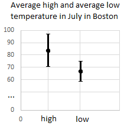

## Exercise 3

The following image shows the average low and average high temperature in from the data in julytemps.txt.

The errorbars represent the 95% confidence interval. The 95% confidence interval for the average high is 83.5 +/- 12.9 and the 95% confidence interval for the average low is 67.2 +/- 7.3. Are these two means statistically significant at the 95% confidence interval?

- Yes
- No [X]

Are these two means statistically significant at the 99.7% confidence interval?

- Yes
- No [X]

Are these two means statistically significant at the 68% confidence interval?

- Yes [X]
- No