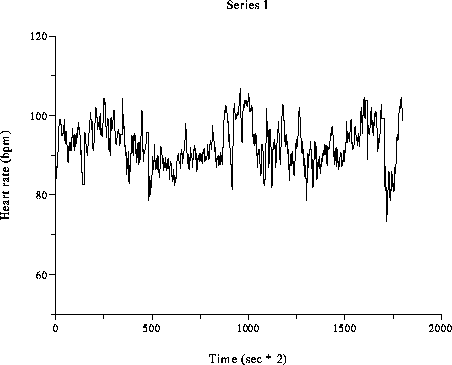
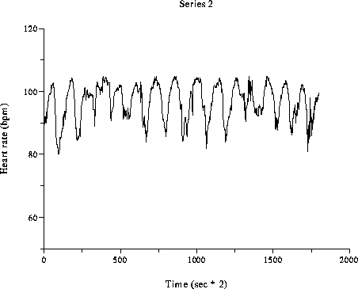

## Exercise 5

You are given two data files. Each file contains 1800 data points measuring the heart rate (in beats per minute, every 0.5 seconds) of a subject prforming comparable activities for the duration of 15 minutes: hr1.txt and hr2.txt. The data is plotted in the figures below. (note that the data is taken from the MIT-BIH Database)

 

Using a sample size of 250, decide whether the following methods of drawing samples will yield samples where the examples are independent of each other.

Using random.sample

- Examples are independent in hr1 sample. [X]
- Examples are independent in hr2 sample. [X]

Getting a random number between 1 and 1800, 250 times.

- Examples are independent in hr1 sample.
- Examples are independent in hr2 sample.
- Neither h1 nor h2 give independent examples. [X]

Starting at the first example and going until the 500th example.

- Examples are independent in hr1 sample.
- Examples are independent in hr2 sample.
- Neither h1 nor h2 give independent examples. [X]