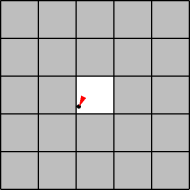
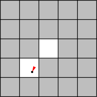
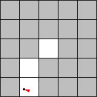

Simulation Overview
iRobot is a company (started by MIT alumni and faculty) that sells the Roomba vacuuming robot (watch one of the product videos to see these robots in action). Roomba robots move around the floor, cleaning the area they pass over.

In this problem set, you will code a simulation to compare how much time a group of Roomba-like robots will take to clean the floor of a room using two different strategies.

The following simplified model of a single robot moving in a square 5x5 room should give you some intuition about the system we are simulating.

The robot starts out at some random position in the room, and with a random direction of motion. The illustrations below show the robot's position (indicated by a black dot) as well as its direction (indicated by the direction of the red arrowhead).

Time t = 0
The robot starts at the position (2.1, 2.2) with an angle of 205 degrees (measured clockwise from "north"). The tile that it is on is now clean.

t = 1
The robot has moved 1 unit in the direction it was facing, to the position (1.7, 1.3), cleaning another tile.

t = 2
The robot has moved 1 unit in the same direction (205 degrees from north), to the position (1.2, 0.4), cleaning another tile.

  
t = 3
The robot could not have moved another unit in the same direction without hitting the wall, so instead it turns to face in a new, random direction, 287 degrees.

 

t = 4
The robot moves along its new direction to the position (0.3, 0.7), cleaning another tile.

### Simulation Details
Here are additional details about the simulation model. Read these carefully.

**Multiple robots**

In general, there are N > 0 robots in the room, where N is given. For simplicity, assume that robots are points and can pass through each other or occupy the same point without interfering.

**The room**

The room is rectangular with some integer width w and height h, which are given. Initially the entire floor is dirty. A robot cannot pass through the walls of the room. A robot may not move to a point outside the room.

**Tiles**

You will need to keep track of which parts of the floor have been cleaned by the robot(s). We will divide the area of the room into 1x1 tiles (there will be w * h such tiles). When a robot's location is anywhere in a tile, we will consider the entire tile to be cleaned (as in the pictures above). By convention, we will refer to the tiles using ordered pairs of integers: (0, 0), (0, 1), ..., (0, h-1), (1, 0), (1, 1), ..., (w-1, h-1).

**Robot motion rules**

Each robot has a position inside the room. We'll represent the position using coordinates (x, y) which are floats satisfying 0 ≤ x < w and 0 ≤ y < h. In our program we'll use instances of the Position class to store these coordinates.

A robot has a direction of motion. We'll represent the direction using an integer d satisfying 0 ≤ d < 360, which gives an angle in degrees.

All robots move at the same speed s, a float, which is given and is constant throughout the simulation. Every time-step, a robot moves in its direction of motion by s units.

If a robot detects that it will hit the wall within the time-step, that time step is instead spent picking a new direction at random. The robot will attempt to move in that direction on the next time step, until it reaches another wall.

**Termination**

The simulation ends when a specified fraction of the tiles in the room have been cleaned.

## Getting Started

### Introduction
In this problem set you will practice designing a simulation and implementing a program that uses classes.

As with previous problem sets, please don't be discouraged by the apparent length of this assignment. There is quite a bit to read and understand, but most of the problems do not involve writing much code.

### Getting Started
Download and save:

- pset2.zip: A zip file of all the files you need, including:
- ps2.py, a skeleton of the solution.
- ps2_visualize.py, code to help you visualize the robot's movement (an optional - but cool! - part of this problem set).
- ps2_verify_movement35.pyc, precompiled module for Python 3.5 that assists with the visualization code. In ps2.py you will uncomment this out if you have Python 3.5.
- ps2_verify_movement36.pyc, precompiled module for Python 3.6 that assists with the visualization code. In ps2.py you will uncomment this out if you have Python 3.6.

REVIEW OBJECT ORIENTED PROGRAMMING AND CLASSES

This and future problem sets will require you to know OOP. If you need a refresher, please visit these links and make sure you are familiar with these topics.

- Implementing new classes and their attributes.
- Understanding class methods.
- Understanding inheritance.
- Telling the difference between a class and an instance of that class - recall that a class is a blueprint of an object, whilst an instance is a single, unique unit of a class.
- Utilizing libraries as black boxes.

Note: If you want to use numpy arrays, you should import numpy as np and use np.METHOD_NAME in your code.